<div style="display: flex; flex-direction: column;justify-content: center; align-items: center; height: 100%; font-family: Rubik">
    <a href="https://gold-caterpillar-530662.hostingersite.com/"><h1 style="font-size: 300%; text-decoration: none; color: black;">TIENDA DE SEÑALES DE TRÁFICO</h1></a>
    <h2 style="font-size: 200%">Proyecto Final DWES</h2>
    <h2 style="font-size: 150%">2º DAW (2024/2025)</h2>
    <a href="https://gold-caterpillar-530662.hostingersite.com/"></a>
    <h3 style="font-size: 200%">Alonso Hernández Robles</h3>
    <a href="https://github.com/AloncraftMC/DWES_ProyectoFinal_AlonsoHernandezRobles"><h3 style="font-size: 100%">github.com/AloncraftMC/DWES_ProyectoFinal_AlonsoHernandezRobles</h3></a>
</div>

<div style="page-break-after: always;"></div>

# Índice

- [0. Introducción](#0-introducción)
- [1. Archivos Raíz](#1-archivos-raíz)
    - [1.1. `index.php`](#11-indexphp)
    - [1.2. `config.php`](#12-configphp)
    - [1.3. `autoload.php`](#13-autoloadphp)
    - [1.4. `.htaccess`](#14-htaccess)
    - [1.5. `.env`](#15-env)
    - [1.6. `.gitignore`](#16-gitignore)
    - [1.7. `README.md`](#17-readmemd)
    - [1.8. `README.pdf`](#18-readmepdf)
- [2. Activos (`assets/`)](#2-activos-assets)
    - [2.1. Estilo (`css/style.css`)](#21-estilo-cssstylecss)
    - [2.2. Fuente (`fonts/Rubik-Regular.ttf`)](#22-fuente-fontsrubik-regularttf)
    - [2.3. Imágenes (`images/`)](#3-imágenes-images)
        - [2.3.1. Recursos](#231-recursos)
        - [2.3.2. Subidas (`uploads/`)](#232-subidas-uploads)
            - [2.3.2.1. Productos (`productos/`)](#2321-productos-productos)
            - [2.3.2.2. Usuarios (`usuarios/`)](#2322-usuarios-usuarios)
- [3. Base de Datos (`database/database.sql`)](#3-base-de-datos-databasedatabasesql)
- [4. Clase `BaseDatos` (`lib/BaseDatos.php`)](#4-librería-libbasedatosphp)
- [5. Clase `Utils` (`helpers/Utils.php`)](#5-librería-helpersutilsphp)
- [6. Modelos (`models/`)](#6-modelos-models)
    - [6.1. `Categoria.php`](#61-categoriaphp)
    - [6.2. `Producto.php`](#62-productophp)
    - [6.3. `Usuario.php`](#63-usuariophp)
    - [6.4. `Pedido.php`](#64-pedidophp)
- [7. Controladores (`controllers/`)](#7-controladores-controllers)
    - [7.0. `ErrorController.php`](#70-errorcontrollerphp)
    - [7.1. `CategoriaController.php`](#71-categoriacontrollerphp)
    - [7.2. `ProductoController.php`](#72-productocontrollerphp)
    - [7.3. `UsuarioController.php`](#73-usuariocontrollerphp)
    - [7.4. `CarritoController.php`](#74-carritocontrollerphp)
    - [7.5. `PedidoController.php`](#75-pedidocontrollerphp)
- [8. Vistas (`views/`)](#8-vistas-views)
    - [8.1. Diseño (`layout/`)](#81-diseño-layout)
        - [8.1.1. `header.php`](#811-headerphp)
        - [8.1.2. `footer.php`](#812-footerphp)
    - [8.2. `categoria/`](#82-categorias)
        - [8.2.1. `admin.php`](#821-adminphp)
        - [8.2.2. `crear.php`](#822-crearphp)
        - [8.2.3. `editar.php`](#823-editarphp)
    - [8.3. `producto/`](#83-productos)
        - [8.3.1. `admin.php`](#831-adminphp)
        - [8.3.2. `crear.php`](#832-crearphp)
        - [8.3.3. `editar.php`](#833-editarphp)
        - [8.3.4. `ver.php`](#834-verphp)
        - [8.3.5. `recomendados.php`](#835-recomendadosphp)
    - [8.4. `usuario/`](#84-usuarios)
        - [8.4.1. `registrarse.php`](#841-registrarsephp)
        - [8.4.2. `login.php`](#842-loginphp)
        - [8.4.3. `gestion.php`](#843-gestionphp)
        - [8.4.4. `admin.php`](#844-adminphp)
        - [8.4.5. `crear.php`](#845-crearphp)
        - [8.4.6. `editar.php`](#846-editarphp)
    - [8.5. `carrito/`](#85-carritos)
        - [8.5.1. `gestion.php`](#851-gestionphp)
    - [8.6. `pedido/`](#86-pedidos)
        - [8.6.1. `admin.php`](#861-adminphp)
        - [8.6.2. `crear.php`](#862-crearphp)
        - [8.6.3. `listo.php`](#863-listophp)
        - [8.6.4. `ver.php`](#864-verphp)
- [9. Uso](#9-uso)
    - [9.1 Local](#91-local)
    - [9.2 Remoto](#92-remoto)

<div style="page-break-after: always;"></div>

# 0. Introducción

Este proyecto consiste en una **Tienda de Señales de Tráfico**, donde los usuarios pueden registrarse, iniciar sesión y ver productos. También existen usuarios con un rol **Administrador**, que tienen ciertos privilegios.

A continuación se detallará la estructura de archivos y carpetas del proyecto.

```
C:.
│   .env
│   .gitignore
│   .htaccess
│   autoload.php
│   config.php
│   index.php
│   README.md
│   README.pdf
│
├───assets
│   ├───css
│   │       style.css
│   │
│   ├───fonts
│   │       Rubik-Regular.ttf
│   │
│   └───images
│       │   carrito.svg
│       │   categoria.svg
│       │   edit.svg
│       │   left.svg
│       │   login.svg
│       │   logo.svg
│       │   logout.svg
│       │   pedido.svg
│       │   producto.svg
│       │   registrarse.svg
│       │   right.svg
│       │   usuario.svg
│       │   usuarios.svg
│       │
│       └───uploads
│           ├───productos
│           │       {...}
│           │
│           └───usuarios
│                   {...}
│
├───controllers
│       CarritoController.php
│       CategoriaController.php
│       ErrorController.php
│       PedidoController.php
│       ProductoController.php
│       UsuarioController.php
│
├───database
│       database.sql
│
├───helpers
│       Utils.php
│
├───lib
│       BaseDatos.php
│
├───models
│       Categoria.php
│       Pedido.php
│       Producto.php
│       Usuario.php
│
└───views
    ├───carrito
    │       gestion.php
    │
    ├───categoria
    │       admin.php
    │       crear.php
    │       editar.php
    │
    ├───layout
    │       footer.php
    │       header.php
    │
    ├───pedido
    │       admin.php
    │       crear.php
    │       listo.php
    │       ver.php
    │
    ├───producto
    │       admin.php
    │       crear.php
    │       editar.php
    │       recomendados.php
    │       ver.php
    │
    └───usuario
            admin.php
            crear.php
            editar.php
            gestion.php
            login.php
            registrarse.php
```

<div style="page-break-after: always;"></div>

# 1. Archivos Raíz

## 1.1. `index.php`

Archivo principal de la aplicación. Se encarga de iniciar la sesión, inicializar algunas variables y cargar el controlador y la acción correspondiente.

Esto se consigue construyendo la página a partir de las vistas de diseño (`views/layout/header.php` y `views/layout/footer.php`) intercalando la vista correspondiente al controlador y acción.

Si no se encuentra el controlador o la acción, se redirige al controlador de errores.

## 1.2. `config.php`

Archivo de configuración de la aplicación. Contiene las constantes de conexión a la base de datos, el controlador y acción por defecto, la ruta base de la aplicación y los objetos por página cuando se haga uso de la paginación.

## 1.3. `autoload.php`

Archivo que se encarga de cargar automáticamente las clases que se vayan a utilizar en la aplicación.

## 1.4. `.htaccess`

Archivo de configuración de Apache. Se encarga de redirigir todas las peticiones a `index.php` y validar rutas amigables.

## 1.5. `.env`

Archivo de configuración de variables de entorno. Contiene las variables de conexión a la base de datos.

En este caso, es necesario usar **Composer** para cargar las variables de entorno. Sin embargo, no se ha conseguido instalar **Composer** en el proyecto.

De todas formas, cabe aclarar que las variables de entorno se encuentran en el archivo `.env` y deberían reemplazarse en el archivo `config.php` para evitar exponer las credenciales de la base de datos.

## 1.6. `.gitignore`

Archivo que contiene los archivos y carpetas que se deben ignorar al subir el proyecto a un repositorio de **Git**. En este caso, solamente se ignora `.env`.

## 1.7. `README.md`

Este archivo. Contiene la documentación del proyecto en formato Markdown.

## 1.8. `README.pdf`

Este archivo. Contiene la documentación del proyecto en formato PDF.

<div style="page-break-after: always;"></div>

# 2. Activos (`assets/`)

## 2.1. Estilo (`css/style.css`)

Archivo CSS que contiene los estilos de la aplicación.

## 2.2. Fuente (`fonts/Rubik-Regular.ttf`)

Fuente **Rubik** utilizada en la aplicación.

## 2.3. Imágenes (`images/`)

### 2.3.1. Recursos

Esta carpeta contiene las imágenes estáticas inmutables que se utilizan en la aplicación.

### 2.3.2. Subidas (`uploads/`)

#### 2.3.2.1. Productos (`productos/`)

Esta carpeta contiene las imágenes de los productos subidas por los usuarios administradores en la creación y edición de productos.

#### 2.3.2.2. Usuarios (`usuarios/`)

Esta carpeta contiene las imágenes de perfil de los usuarios subidas por los usuarios tanto convencionales como administradores en la creación y edición de usuarios, además de en la gestión de usuarios convencionales.

# 3. Base de Datos (`database/database.sql`)

Archivo SQL que contiene la estructura de la base de datos. Se debe importar en **phpMyAdmin** o en la terminal de **MySQL**.

# 4. Clase `BaseDatos` (`lib/BaseDatos.php`)

Clase que contiene los métodos necesarios para la conexión a la base de datos.

# 5. Clase `Utils` (`helpers/Utils.php`)

Clase que contiene métodos útiles para la aplicación, como validaciones de rol, identidad y eliminación de campos en la variable superglobal `$_SESSION`, cookies, etc.

<div style="page-break-after: always;"></div>

# 6. Modelos (`models/`)

## 6.1. `Categoria.php`

Modelo de la categoría. Contiene los métodos necesarios para la gestión de las categorías.

## 6.2. `Producto.php`

Modelo del producto. Contiene los métodos necesarios para la gestión de los productos.

## 6.3. `Usuario.php`

Modelo del usuario. Contiene los métodos necesarios para la gestión de los usuarios.

## 6.4. `Pedido.php`

Modelo del pedido. Contiene los métodos necesarios para la gestión de los pedidos.

# 7. Controladores (`controllers/`)

## 7.0. `ErrorController.php`

Controlador de errores. Es invocado cuando no se encuentra el controlador o la acción correspondiente.

- `ErrorController::index()`: Muestra un mensaje de error 404.

## 7.1. `CategoriaController.php`

Controlador de categorías. Contiene los métodos necesarios para la gestión de las categorías.

- `CategoriaController::admin()`: Muestra todas la administración de las categorías con paginación.
- `CategoriaController::crear()`: Muestra el formulario de creación de categorías.
- `CategoriaController::guardar()`: Guarda la categoría en la base de datos y redirige a la administración de categorías.
- `CategoriaController::editar()`: Actualiza la categoría en la base de datos y redirige a la administración de categorías.
- `CategoriaController::gestion()`: Muestra el formulario de edición de categorías.
- `CategoriaController::eliminar()`: Elimina la categoría de la base de datos y redirige a la administración de categorías.

<div style="page-break-after: always;"></div>

## 7.2. `ProductoController.php`

Controlador de productos. Contiene los métodos necesarios para la gestión de los productos.

- `ProductoController::recomendados()`: Muestra la vista de los productos recomendados con paginación.
- `ProductoController::admin()`: Muestra todas la administración de los productos con paginación.
- `ProductoController::crear()`: Muestra el formulario de creación de productos.
- `ProductoController::guardar()`: Guarda el producto en la base de datos y redirige a la administración de productos.
- `ProductoController::editar()`: Actualiza el producto en la base de datos y redirige a la administración de productos.
- `ProductoController::gestion()`: Muestra el formulario de edición de productos.
- `ProductoController::eliminar()`: Elimina el producto de la base de datos y redirige a la administración de productos.
- `ProductoController::ver()`: Muestra la vista de un producto.

## 7.3. `UsuarioController.php`

Controlador de usuarios. Contiene los métodos necesarios para la gestión de los usuarios.

- `UsuarioController::registrarse()`: Muestra el formulario de registro de usuarios.
- `UsuarioController::guardar()`: Guarda el usuario en la base de datos y redirige a la página de inicio.
- `UsuarioController::login()`: Muestra el formulario de inicio de sesión.
- `UsuarioController::entrar()`: Inicia la sesión del usuario y redirige a la página de inicio.
- `UsuarioController::salir()`: Cierra la sesión del usuario y redirige a la página de inicio.
- `UsuarioController::gestion()`: Muestra la página de gestión del usuario.
- `UsuarioController::admin()`: Muestra todas la administración de los usuarios con paginación.
- `UsuarioController::crear()`: Muestra el formulario de creación de usuarios.
- `UsuarioController::editar()`: Actualiza el usuario en la base de datos, tanto para usuarios convencionales como para administradores.
- `UsuarioController::eliminar()`: Elimina el usuario de la base de datos.

## 7.4. `CarritoController.php`

Controlador del carrito. Contiene los métodos necesarios para la gestión del carrito.

- `CarritoController::gestion()`: Muestra la página de gestión del carrito.
- `CarritoController::add()`: Añade un producto al carrito.
- `CarritoController::delete()`: Elimina un producto del carrito.
- `CarritoController::clear()`: Vacía el carrito.
- `CarritoController::up()`: Incrementa la cantidad de un producto en el carrito.
- `CarritoController::down()`: Decrementa la cantidad de un producto en el carrito.

<div style="page-break-after: always;"></div>

## 7.5. `PedidoController.php`

Controlador de pedidos. Contiene los métodos necesarios para la gestión de los pedidos. Está parcialmente implementado.

- `PedidoController::admin()`: Muestra todas la administración de los pedidos con paginación. No se ha implementado.
- `PedidoController::crear()`: Muestra el formulario de datos de envío.
- `PedidoController::hacer()`: Guarda el pedido en la base de datos y redirige a la página de pedido listo. No se ha implementado del todo.
- `PedidoController::listo()`: Muestra la página de pedido listo.
- `PedidoController::ver()`: Muestra la vista de un pedido para administradores. No se ha implementado.
- `PedidoController::confirmar()`: Confirma o actualiza en general el estado de un pedido para administradores. No se ha implementado.
- `PedidoController::eliminar()`: Elimina un pedido de la base de datos para administradores. No se ha implementado.

<div style="page-break-after: always;"></div>

# 8. Vistas (`views/`)

## 8.1. Diseño (`layout/`)

### 8.1.1. `header.php`

Vista de cabecera. Si no hay sesión iniciada, muestra lo siguiente:

- **Título de la página**. Redirige a la página de productos recomendados.
- **Registrarse**. Redirige a la página de registro. 
- **Iniciar sesión**. Redirige a la página de inicio de sesión.


Después de iniciar sesión, se muestra lo siguiente, dependiendo de la vista, que es diferente para usuarios convencionales y administradores.

Usuarios convencionales:

- **Carrito**. Muestra el número de productos en el carrito y redirige a la página de gestión del carrito.
- **Usuario**. Muestra el nombre de usuario y redirige a la página de gestión del usuario.
- **Cerrar sesión**. Cierra la sesión del usuario.


Administradores (añade lo siguiente):

- **Categorías**. Redirige a la página de administración de categorías.
- **Productos**. Redirige a la página de administración de productos.
- **Pedidos**. No se ha implementado.
- **Usuarios**. Redirige a la página de administración de usuarios.


<div style="page-break-after: always;"></div>

Si un administrador entra y es su primera vez, se le mostrará un mensaje de advertencia sobre riesgos de uso, generado en el header.

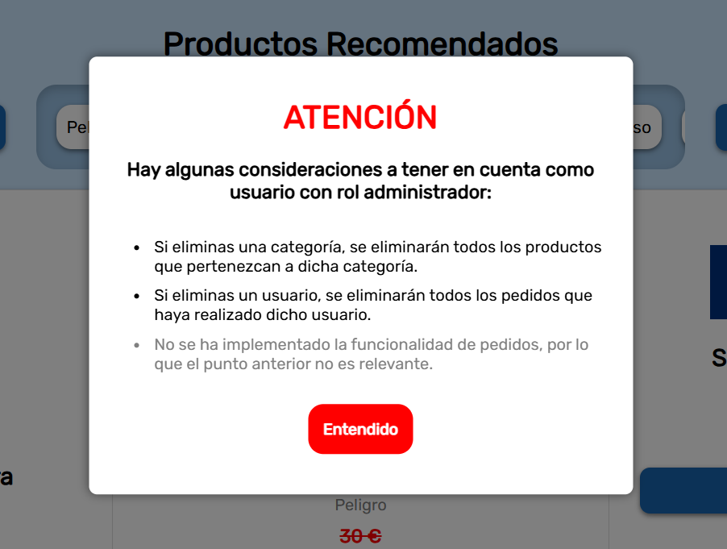

### 8.1.2. `footer.php`

Vista de pie de página. Contiene el año actual y el nombre del autor.


<div style="page-break-after: always;"></div>

## 8.2. `categoria/`

### 8.2.1. `admin.php`

Vista de administración de categorías. Muestra todas las categorías con paginación. Contiene botones para crear, editar y eliminar categorías.

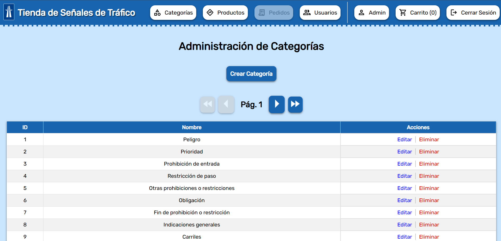

### 8.2.2. `crear.php`

Vista de creación de categorías. Contiene un formulario con el campo necesario para crear una categoría.


<div style="page-break-after: always;"></div>

### 8.2.3. `editar.php`

Vista de edición de categorías. Contiene un formulario con el campo necesario para editar una categoría.


## 8.3. `producto/`

### 8.3.1. `admin.php`

Vista de administración de productos. Muestra todos los productos con paginación. Contiene botones para crear, editar y eliminar productos.

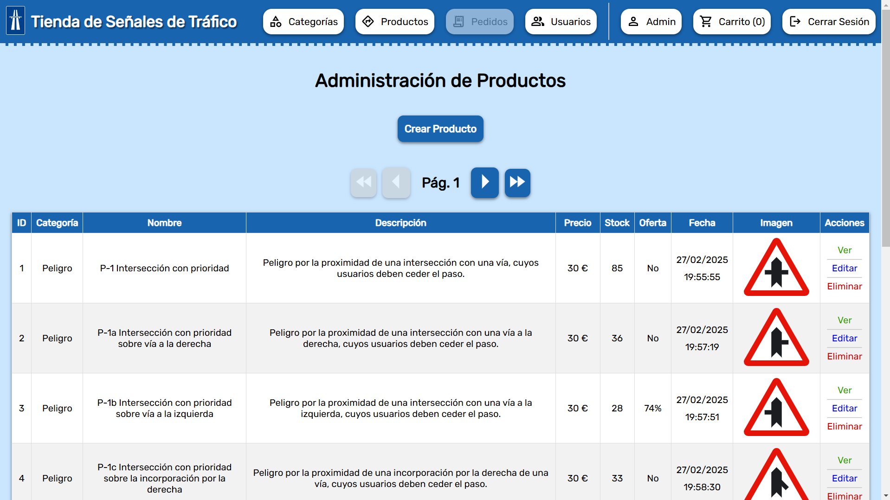

<div style="page-break-after: always;"></div>

### 8.3.2. `crear.php`

Vista de creación de productos. Contiene un formulario con los campos necesarios para crear un producto.

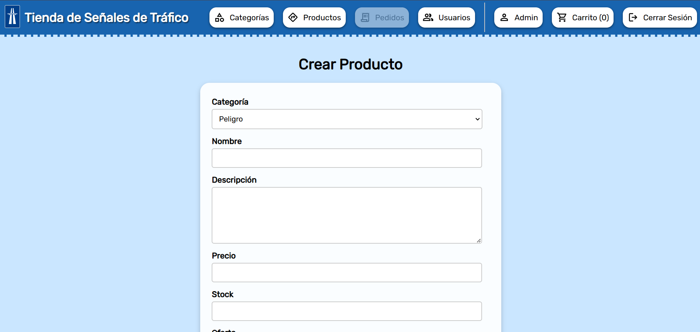

### 8.3.3. `editar.php`

Vista de edición de productos. Contiene un formulario con los campos necesarios para editar un producto.

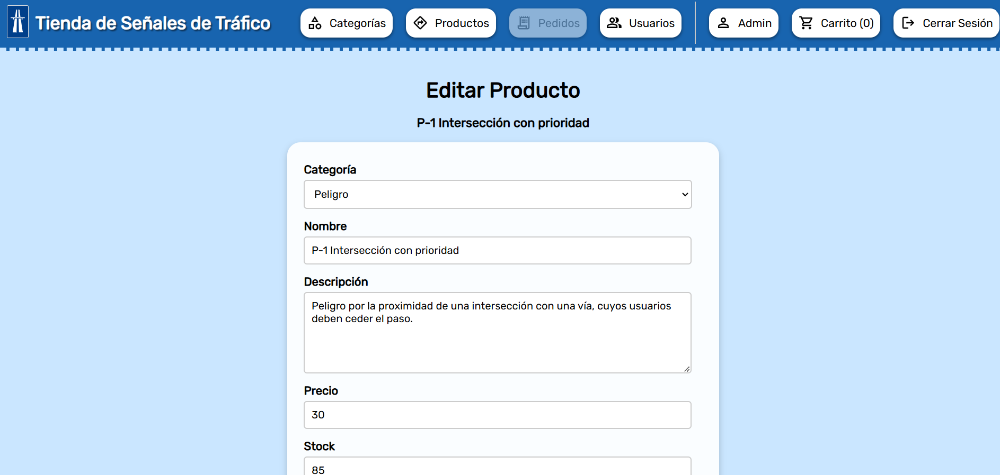

<div style="page-break-after: always;"></div>

### 8.3.4. `ver.php`

Vista de un producto. Muestra la información de un producto. Contiene un botón para añadir el producto al carrito en caso de que haya stock. Si no hay stock, muestra un mensaje de que el producto está agotado.

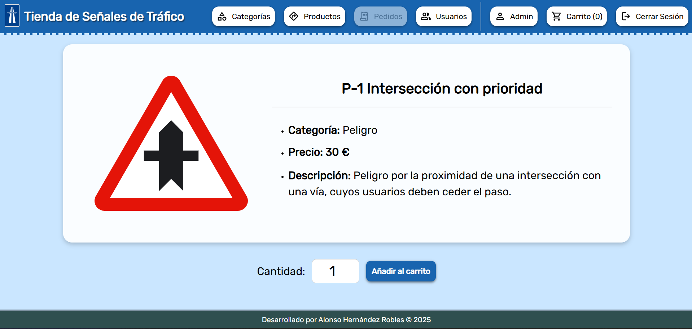

### 8.3.5. `recomendados.php`

Vista de productos recomendados. Muestra 6 productos recomendados.

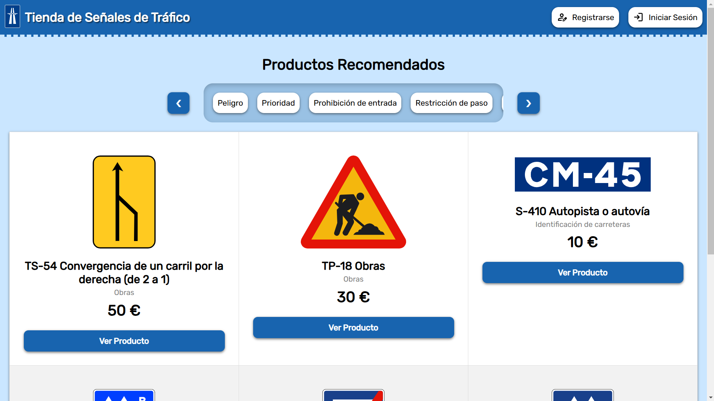

<div style="page-break-after: always;"></div>

El usuario puede filtrar por categorías. En tal caso y si hubiera más de 6 productos en la categoría a visualizar (caso bastante probable), se mostrarán los 6 primeros productos de la categoría ordenadamente mediante paginación. Esto es configurable en el archivo `config.php`.

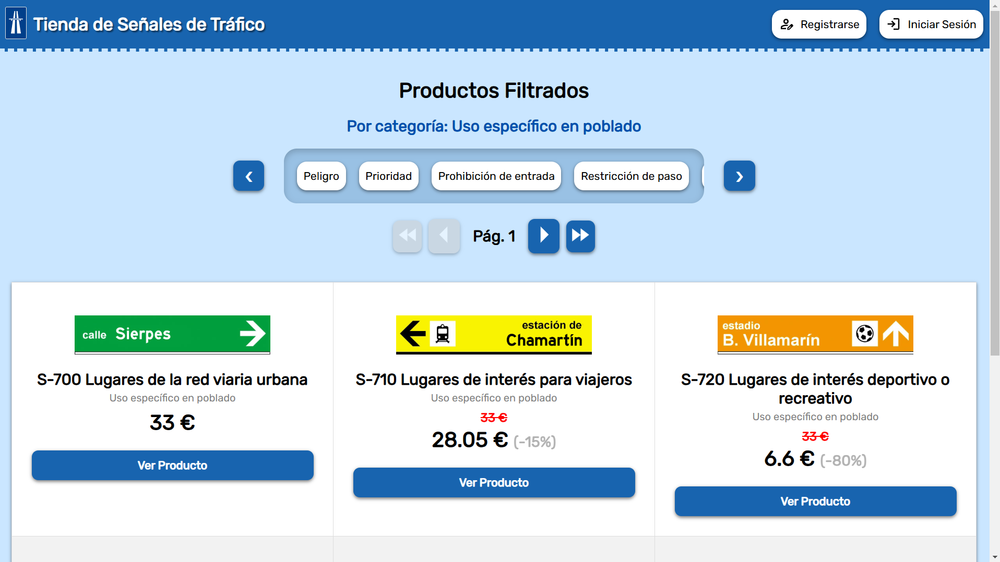

## 8.4. `usuario/`

### 8.4.1. `registrarse.php`

Vista de registro de usuarios. Contiene un formulario con los campos necesarios para registrarse.

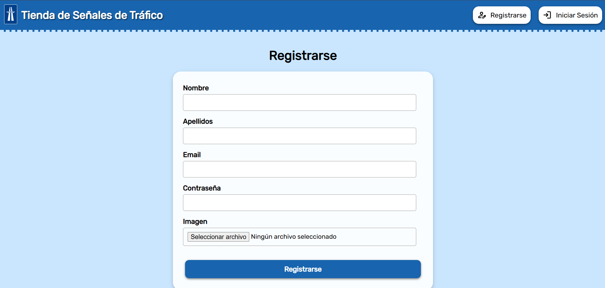

<div style="page-break-after: always;"></div>

### 8.4.2. `login.php`

Vista de inicio de sesión. Contiene un formulario con los campos necesarios para iniciar sesión y una casilla para recordar la sesión una semana (7 días) mediante una cookie.

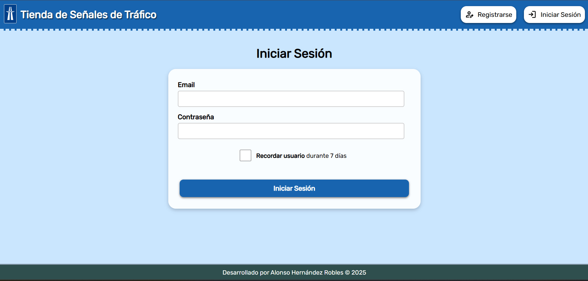

### 8.4.3. `gestion.php`

Vista de gestión de usuarios. Muestra la información del usuario y contiene botones para guardar cambios y eliminar el usuario.

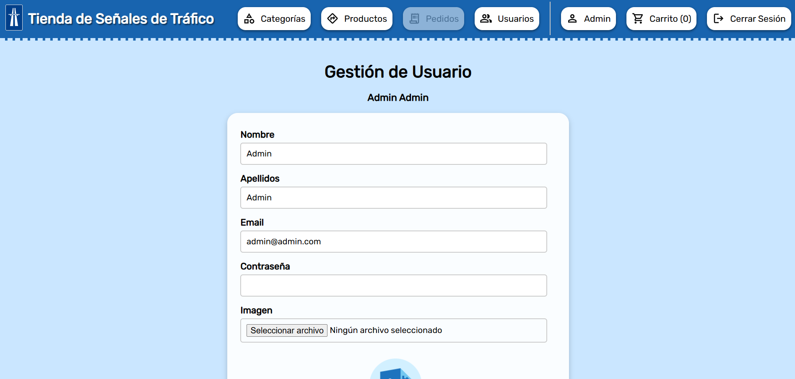

<div style="page-break-after: always;"></div>

### 8.4.4. `admin.php`

Vista de administración de usuarios. Muestra todos los usuarios con paginación. Contiene botones para crear, editar y eliminar usuarios.

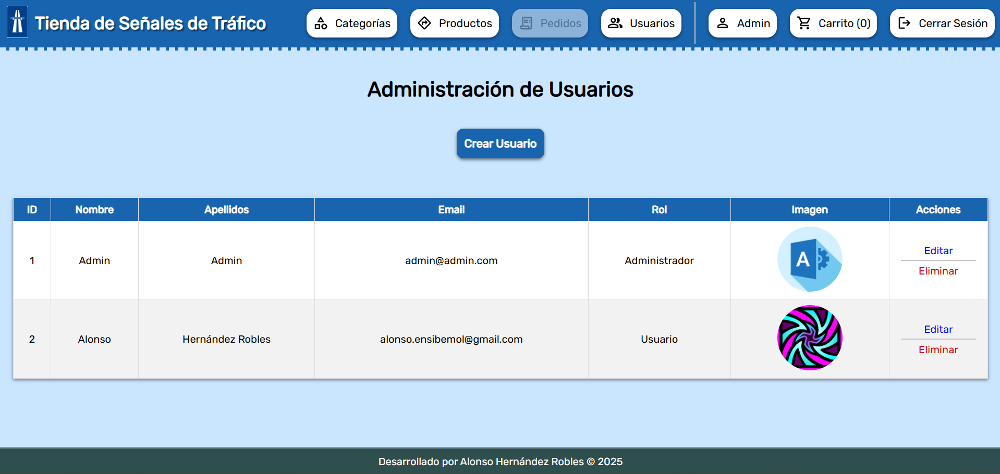

### 8.4.5. `crear.php`

Vista de creación de usuarios. Contiene un formulario con los campos necesarios para crear un usuario, incluyendo la posibilidad de establecer el rol del usuario.

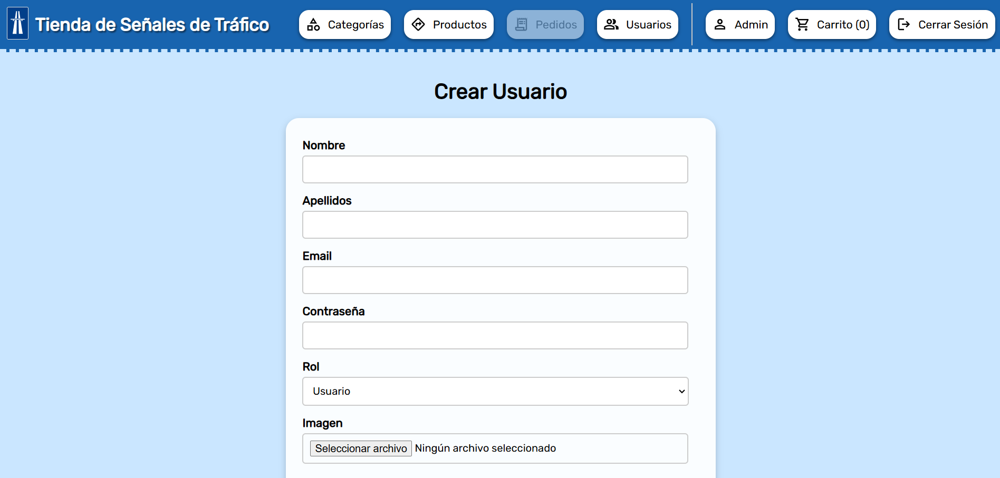

<div style="page-break-after: always;"></div>

### 8.4.6. `editar.php`

Vista de edición de usuarios. Contiene un formulario con los campos necesarios para editar un usuario, incluyendo la posibilidad de establecer el rol del usuario.

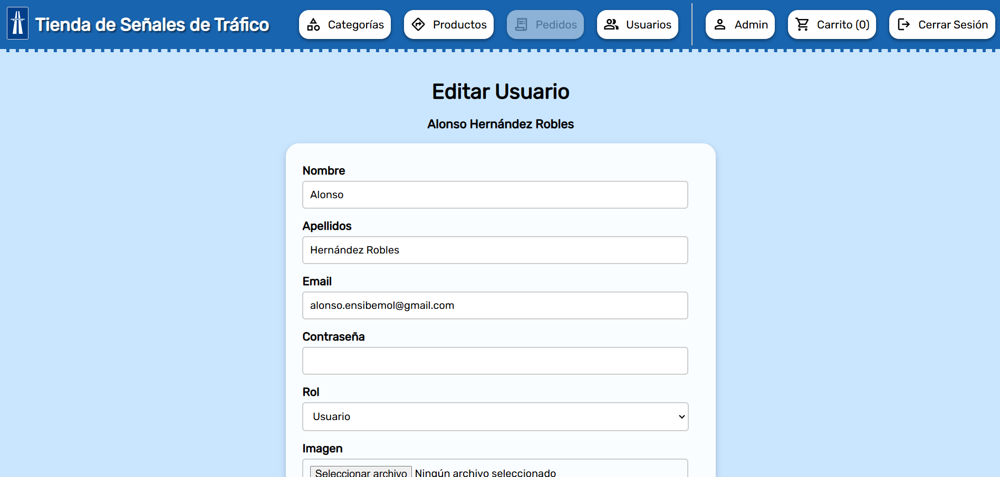

## 8.5. `carrito/`

### 8.5.1. `gestion.php`

Vista de gestión del carrito. Muestra los productos del carrito con la cantidad y el precio total. Contiene botones para eliminar un producto, vaciar el carrito, incrementar y decrementar la cantidad de un producto.

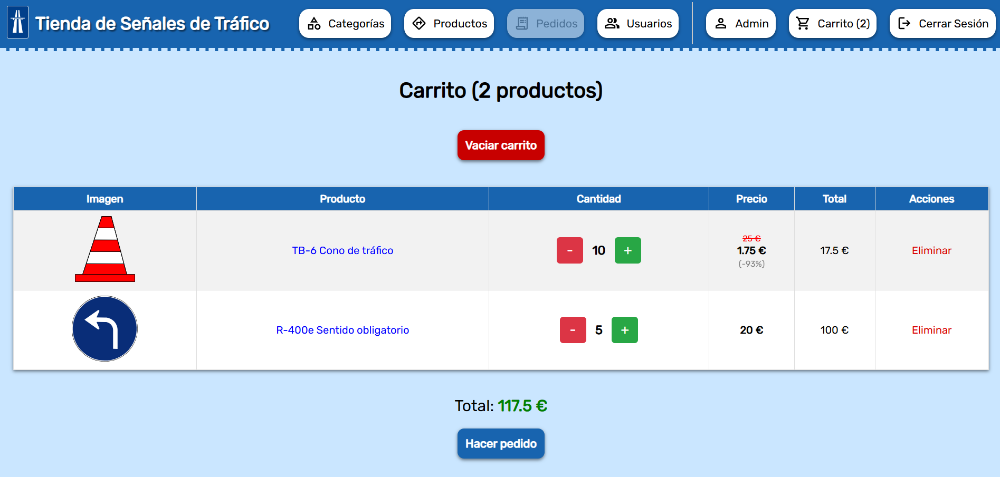

<div style="page-break-after: always;"></div>

## 8.6. `pedido/`

### 8.6.1. `admin.php`

Vista de administración de pedidos. Muestra todos los pedidos con paginación. Contiene botones para ver, confirmar y eliminar pedidos.

No se ha implementado.

### 8.6.2. `crear.php`

Vista de datos de envío. Contiene un formulario con los campos necesarios de ubicación para realizar un pedido.

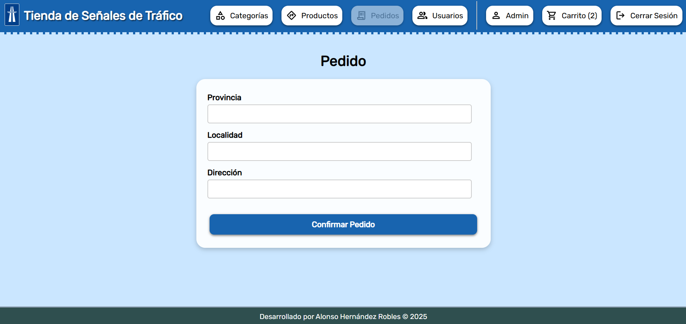

### 8.6.3. `listo.php`

Vista de pedido listo. Muestra un mensaje de que el pedido se ha realizado correctamente junto a un botón para seguir comprando.


<div style="page-break-after: always;"></div>

### 8.6.4. `ver.php`

Vista de un pedido. Muestra la información de un pedido. Contiene botones para confirmar y eliminar el pedido.

No se ha implementado.

# 9. Uso

## 9.1 Local

Para utilizar la aplicación localmente, se debe importar la base de datos `database.sql` en **phpMyAdmin** o en la terminal de **MySQL**.

La base de datos contiene:

- **2 Usuarios**
    - *Admin Admin* (Administrador)
        - Correo: admin@admin.com
        - Contraseña: `a1a1a1a1`
    - *Alonso Hernández Robles* (Usuario convencional)
        - Correo: alonso.ensibemol@gmail.com
        - Contraseña: `a1a1a1a1`
- **438 Productos** (Prácticamente todas las señales que existen en la *DGT*)
- **21 Categorías** (En las que la *DGT* clasifica las señales de tráfico en última instancia)

<table style="border: 1px solid black; border-collapse: collapse;">
    <tr style="border: 1px solid black;">
        <td style="border: 1px solid black;">Peligro</td>
        <td style="border: 1px solid black;">Prioridad</td>
        <td style="border: 1px solid black;">Prohibición de entrada</td>
        <td style="border: 1px solid black;">Restricción de paso</td>
        <td style="border: 1px solid black;">Otras prohibiciones o restricciones</td>
        <td style="border: 1px solid black;">Obligación</td>
        <td style="border: 1px solid black;">Fin de prohibición o restricción</td>
    </tr>
    <tr style="border: 1px solid black;">
        <td style="border: 1px solid black;">Indicaciones generales</td>
        <td style="border: 1px solid black;">Carriles</td>
        <td style="border: 1px solid black;">Servicio</td>
        <td style="border: 1px solid black;">Preseñalización</td>
        <td style="border: 1px solid black;">Dirección</td>
        <td style="border: 1px solid black;">Identificación de carreteras</td>
        <td style="border: 1px solid black;">Localización</td>
    </tr>
    <tr style="border: 1px solid black;">
        <td style="border: 1px solid black;">Confirmación</td>
        <td style="border: 1px solid black;">Uso específico en poblado</td>
        <td style="border: 1px solid black;">Paneles complementarios</td>
        <td style="border: 1px solid black;">Otras indicaciones</td>
        <td style="border: 1px solid black;">Vehículos</td>
        <td style="border: 1px solid black;">Obras</td>
        <td style="border: 1px solid black;">Balizamiento reflectante</td>
    </tr>
</table>

Todo lo relativo a pedidos no está implementado, pero se ha dejado la estructura principal del flujo lógico de la aplicación (ej. vistas de crear pedido, pedido listo, etc.).

## 9.2 Remoto

La aplicación se ha desplegado remotamente en **Hostinger**. Se puede acceder a ella a través del siguiente enlace:

<h1><a href="https://gold-caterpillar-530662.hostingersite.com/" target="_blank">https://gold-caterpillar-530662.hostingersite.com/</a></h1>